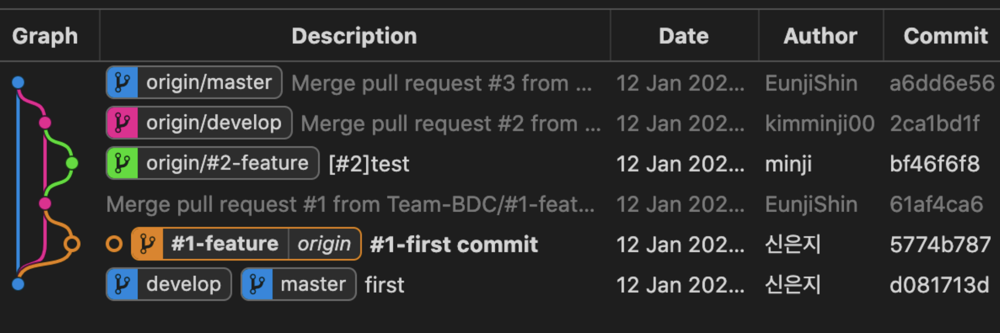

### 아래 레퍼런스를 참고

> https://gmlwjd9405.github.io/2018/05/11/types-of-git-branch.html

# 1. Gitflow Workflow (git-flow)

> branch model.
> 대형 프로젝트에도 적용가능한 엄격한 작업절차
> master와 develop 두개의 브랜치 이용 -> 아래 브랜치 모델 참고

- master : 가장 최근의 실행가능한 상태
- hotfixes : 출시 버전에 발생한 버그 긴급 수정.
- release branches : 출시 준비. 출시와 관련된 작업. 언젠가 develop에 병합되어야한다.
- develop : 실행가능한 상태를 만든다
- feature : 신규 기능을 위한 브랜치

## 1-1. branch 활용

> 출시 제외하고 master, develop, feature 이용한다고 가정, 아래 순서를 따른다.
> command 이용해도 되는데 헷갈리니까 구냥 깃헙 왔다갔다 하는게 좋을듯

1. 레포 만들고 clone
2. 한명이 develop 브랜치를 만든다.
3. 다른사람들이 pull해서 develop을 받아온다.
4. git checkout -b [브랜치명] develop 명령어를 쳐서, develop에서 feature 브랜치를 분기한다.
5. feature 브랜치로 넘어가서 작업한다.
6. feature 브랜치에서 commit한다.
7. git push -u origin [브랜치명]으로 브랜치 푸시
8. github으로 와서 [브랜치명]으로 들어와서, develop으로 pull request를 보낸다.
9. develop에서 merge 한다.
10. (개발 완료시) develop에서 master로 Pull request 보낸다.
11. master에서 merge 한다.

# 2. 또 다른 Github 협업 방법

## 1-2. Feature Branch Workflow

> 기능별 브랜치를 만들어서 작업한다는 컨셉
> 팀 구성원들이 메인 코드 베이스를 중심으로 안전하게 개발하는 경우
> 소규모 프로젝트에서 많이 사용한다.

1. 클론한 후 각자 브랜치 따고
2. 코드 수정 후 커밋하고
3. 새로운 기능 브랜치를 리모트 저장소에 푸시하고
4. 오너에게 풀리퀘 보내면
5. 오너가 확인 후 Merge
6. 로컬 브랜치를 master 브랜치로 이동 : 로컬와 리모트 동기화 목적
7. 새로운 커밋은 pull로 가져온다
8. 1부터 다시 반복

## 1-3. Forking Workflow

> 중앙 저장소를 각자 fork해서 자신의 원격저장소와 로컬 저장소 2개를 갖는 방식
> 팀 구성원들이 바로 중앙 저장소에 푸시하는게 아니라, 자신의 원격저장소에 푸시 후 오너가 팀원 기여분을 merge
> 큰 규모의 분산된 프로젝트에서 협업하기 좋다.
> 오픈소스 프로젝트에서 많이 사용

1. fork하고
2. 로컬 저장소 만들고 (clone)
3. 원격저장소와 중앙저장소 연결 ->> 보통 upstream 별칭으로 지정
4. 로컬에서 branch 만들고 개발
5. 자신의 원격저장소에 push
6. 중앙저장소로 pull request
7. 오너가 merge
8. 로컬 브랜치를 master branch로 이동 : 로컬과 중앙 동기화 목적
9. 새로운 커밋은 pull로
10. 4부터 다시 반복
