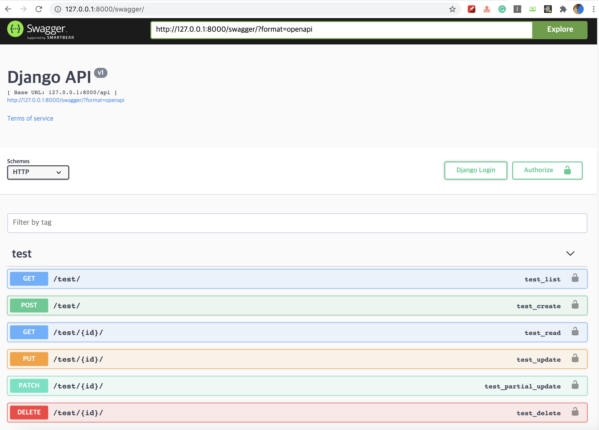

# swagger

> API 서버를 자동으로 문서화해주는 툴
> API 주소나 각 메소드를 명시해주며, payload도 문서 내에서 사용할 수 있다.

> python-django의 경우, drf-yasg 라이브러리 또는 django rest swagger을 사용한다.
> django rest swagger은 문제가 많고 불편하다고 하니, drf-yasg를 이용하기로 한다.

```
공식문서 : https://drf-yasg.readthedocs.io/en/stable/
```

## Compatible with

- Django Rest Framework: 3.10, 3.11, 3.12
- Django: 2.2, 3.0, 3.1
- Python: 3.6, 3.7, 3.8, 3.9

## 1. 프로젝트 세팅

```
cd swagger
cd MIA
pip3 install -r requirements.txt
...
Successfully built a597836853da
```

## 2. swagger 추가 과정

### 2-1. projectMIA/projectMIA/settings.py

```
INSTALLED_APPS = [
    ...
    'drf_yasg',
    ...
]

```

### 2-2. projectMIA/projectMIA/urls.py

```
...
from rest_framework import permissions
from drf_yasg.views import get_schema_view
from drf_yasg import openapi
...

schema_view = get_schema_view(
   openapi.Info(
      title="Snippets API",
      default_version='v1',
      description="Test description",
      terms_of_service="https://www.google.com/policies/terms/",
      contact=openapi.Contact(email="contact@snippets.local"),
      license=openapi.License(name="BSD License"),
   ),
   public=True,
   permission_classes=[permissions.AllowAny],
)

urlpatterns = [
   url(r'^swagger(?P<format>\.json|\.yaml)$', schema_view.without_ui(cache_timeout=0), name='schema-json'),
   url(r'^swagger/$', schema_view.with_ui('swagger', cache_timeout=0), name='schema-swagger-ui'),
   url(r'^redoc/$', schema_view.with_ui('redoc', cache_timeout=0), name='schema-redoc'),
   ...
]


```

### 2-3. Migrate

```
python3 manage.py makemigrations
python3 manage.py migrate

```

### 2-4. 실행

```
http://localhost:8000/swagger
http://localhost:8000/redoc

```


